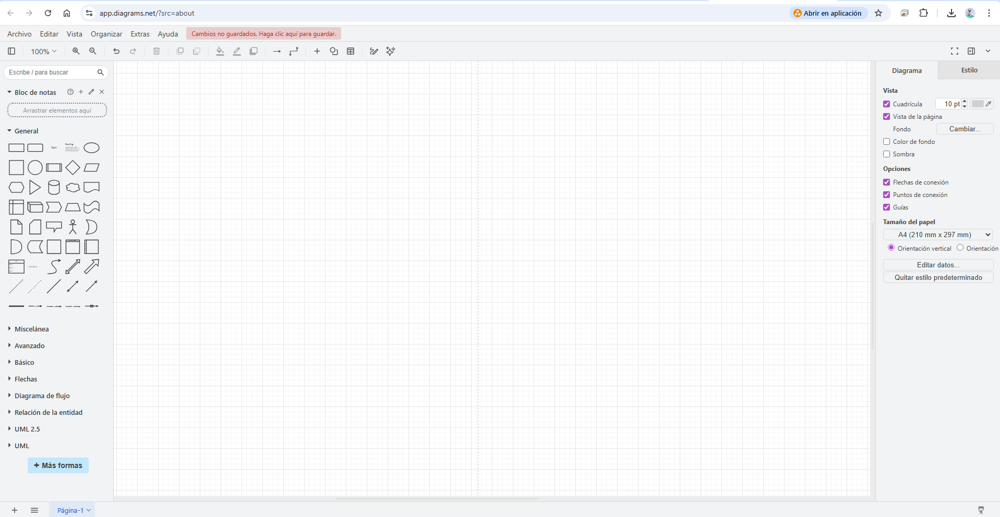
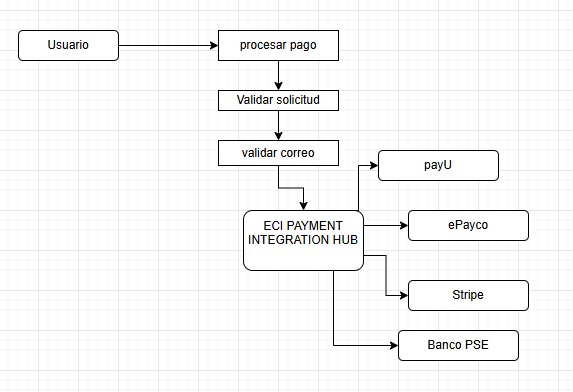
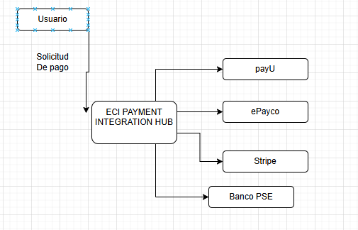

# DOSW_ParcialT1_Samuel_Gil
## Samuel Antonio Gil Romero
## DOSW-2
## Herramientas de modelado

## Herramienta de diseño

## punto 1 digrama de contexto 

## punto 2 Patrones de diseño que eligire para el ejercicio ECI PAYMENT INTEGRATION HUB
-Implementare Adapter
- un patron Estructural
- justificacion : tengo 4 proveedores que se comunican de manera distinta esto me lleva a elegirlo "Cada proveedor expone la información de forma distinta"

- implementare Abstract Factory (creacional)
- el crea familias relacionadas de objetos 

## punto 3 

# Funcionales
-procesar el pago con proveedor adecuado  
-validar solicitudes antes de procesarlas  
-unificar respuestas de proveedores

# NOFUNCIONALES
-Rendimiento  
-paleta de colores usabilidad o identidad 

## punto 4 
diagrama de casos de uso

  
historia de usuario 
RF1: procesar pago 
como usuario estudiantil  
quiero realizar un pago de un servicio institucional usando mi medio de pago preferido  
para completar mi tramite de forma rapida sin importar qle proveedor 

RF2 : Validar solicitud 
como sistema de pagos Institucional  
quiero validar los datos de cada solicitud antes del proceso  
para rechazar las solicitudes invalidas 

##punto #5
# RF1 – Procesar Pago con Proveedor Adecuado

**Tipo:** Funcional  
**Prioridad:** Alta  
**Patrón:** Abstract Factory + Adapter

---

## Descripción
El sistema procesa una solicitud de pago seleccionando automáticamente el proveedor según medio y moneda. La respuesta siempre se adapta al formato institucional estándar.

---

## Actores
- **Principal:** Usuario institucional
- **Secundarios:** PayU, ePayco, Stripe, BancoPSE

---

## Precondiciones
- Solicitud completa enviada
- Validación RF2 aprobada
- Al menos un proveedor disponible

## Flujo Principal
1. Usuario envía solicitud
2. Sistema valida (RF2)
3. Selección de proveedor:
    - USD → Stripe
    - PSE → BancoPSE
    - TARJETA → PayU
    - Otro → ePayco
4. Abstract Factory crea conector y normalizador
5. Se envía solicitud al proveedor
6. Adapter normaliza respuesta
7. Sistema retorna respuesta estándar

---

## Flujos Alternativos
**Validación falla**  
→ Estado RECHAZADO  
→ No se contacta proveedor

**Proveedor falla**  
→ Estado PENDIENTE  
→ Mensaje: "Transacción en validación bancaria"

---
## Postcondiciones
- Pago registrado en MongoDB Atlas
- Respuesta estándar: `estado | codigoTransaccion | mensaje | fecha`
- Certificado guardado en S3 (si aplica)

---

## Reglas de Negocio
- USD → Solo Stripe
- PSE → Solo BancoPSE
- Falla proveedor → PENDIENTE
- Respuesta siempre en formato estándar
- Campos extra del proveedor se ignoran

## Excepciones
- Proveedor no disponible → PENDIENTE
- Medio no reconocido → ePayco (por defecto)  

## punto 6 
# Épica: Integración con Proveedores de Pago

El sistema debe procesar pagos institucionales usando cualquier proveedor (PayU, ePayco, Stripe, BancoPSE) sin acoplar el flujo a una implementación específica y retornando siempre respuesta en formato estándar.

---

## Historia de Usuario

**Como** usuario institucional  
**Quiero** pagar con mi medio preferido (tarjeta, PSE, transferencia)  
**Para** completar mi trámite y recibir el estado del pago sin importar el proveedor.

### Criterios de Aceptación
- USD → Stripe obligatorio
- PSE → BancoPSE obligatorio
- Si proveedor falla → PENDIENTE
- Respuesta en formato estándar
- Tiempo máximo: 3 segundos

---

# Tareas

## T1 – Interfaces Base
Definir contratos del sistema:

- `IProveedorFactory` → crearConector(), crearNormalizador()
- `IConector` → enviarPago()
- `INormalizador` → normalizar()

**Patrón:** Abstract Factory + Adapter  
**SOLID:** ISP + DIP

---

## T2 – Fábricas Concretas
Implementar 4 fábricas:

- PayUFactory
- StripeFactory
- PSEFactory
- ePaycoFactory

Cada una crea su conector y normalizador.

**Patrón:** Abstract Factory  
**SOLID:** Open/Closed

---

## T3 – Normalizadores (Adapters)
Traducen la respuesta del proveedor a `RespuestaPago` estándar.

- PayU → JSON
- Stripe → SDK
- PSE → Texto
- ePayco → SHA

**Patrón:** Adapter  
**SOLID:** Single Responsibility

---

## T4 – SelectorFactory
Reglas de negocio:

- USD → StripeFactory
- PSE → PSEFactory
- TARJETA → PayUFactory
- Otro → ePaycoFactory

**Patrón:** Abstract Factory  
**SOLID:** SRP

---

## T5 – ProcesadorPago
Orquesta el flujo:

1. validar() → si falla: RECHAZADO
2. seleccionar factory
3. crearConector()
4. enviarPago()
5. normalizar()
6. Error proveedor → PENDIENTE

**Patrón:** Abstract Factory + Adapter  

---

## Resumen

Épica  
└── Historia de Usuario  
      ├── T1 Interfaces  
      ├── T2 Fábricas  
      ├── T3 Adapters  
      ├── T4 Selector  
      └── T5 Procesador
## punto 7 

Single responsability
cada clase tendra que tener unas sola responsabilidad 
open/close 
si en otro momento llega a aparecer otro proveedor se va a poder extender sin necesidad de cambiar  

